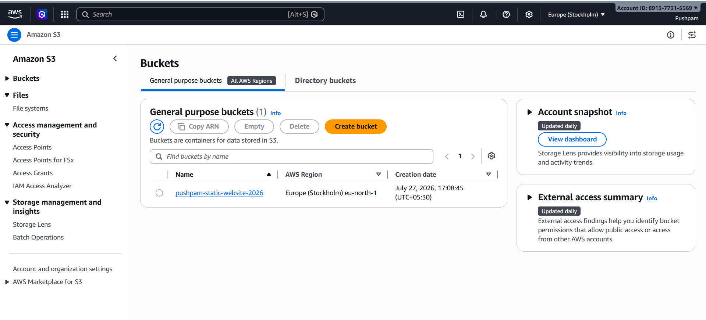
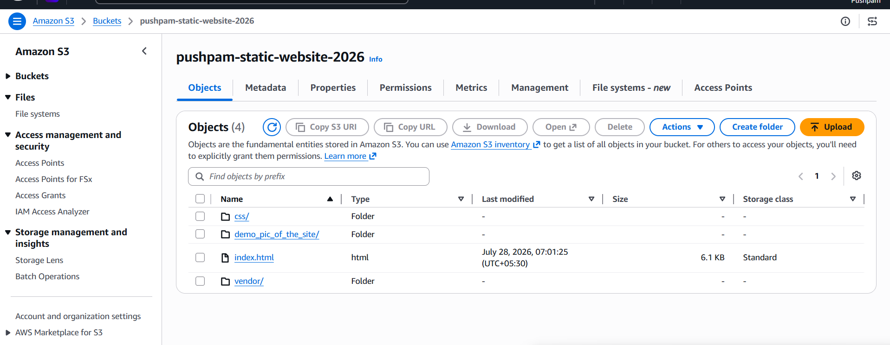
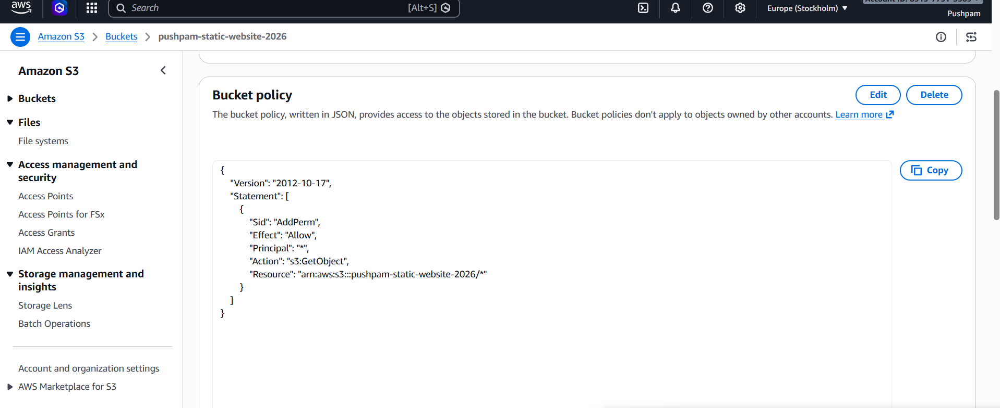
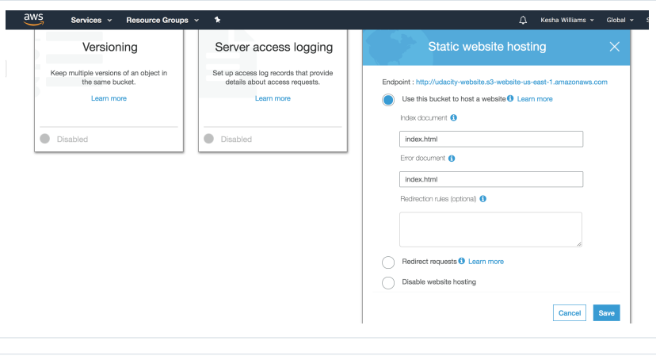
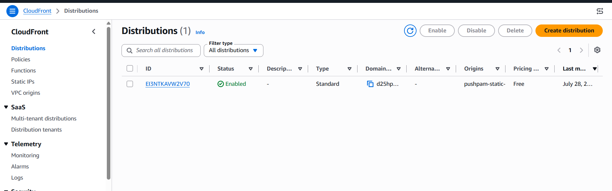

# Deploy a Static Website on AWS

## CloudFront Domain URL
https://d25hp13vx3saon.cloudfront.net

## S3 Website Endpoint URL
http://pushpam-static-website-2026.s3-website.eu-north-1.amazonaws.com

## Project Overview
The cloud is perfect for hosting static websites that only include HTML, CSS, and JavaScript files that require no server-side processing. In this project, I deployed a static website to AWS. First, I created an S3 bucket, configured it for static website hosting, and secured it using IAM policies. Next, I uploaded the website files to the bucket and sped up content delivery using CloudFront. Finally, I accessed the website in a browser using the endpoint URL.

## File Summary
- `index.html` - The index document for the website.
- `img/` - Background and content image files for the website.
- `vendor/` - Bootstrap CSS framework, Font Awesome icons, and JavaScript libraries.
- `css/` - Custom CSS files for the website.

## Steps of the Project
1. Create an S3 bucket where you need to uncheck “Block all public access”.
   
2. Upload the files and folders from your local computer to the S3 bucket.
   
3. Change the bucket policy according to your bucket policy file.
   
4. Make the bucket host a website using the bucket Properties tab.
   
5. In CloudFront, create a distribution and use your S3 bucket under “Origin Domain Name.”
   
6. Open a web browser, paste the CloudFront endpoint URL, and append `/index.html` if needed.
   

## About
In this project, a static website was deployed to AWS using Amazon S3 and CloudFront. The website files were uploaded to the S3 bucket and served as a public static website.

### Topics
- AWS S3
- AWS CloudFront
- Static website hosting
- HTML, CSS, JavaScript

### Resources
- README
- Project screenshots

### Author
- **Pushpam Kumar**

### Languages
- CSS
- HTML
